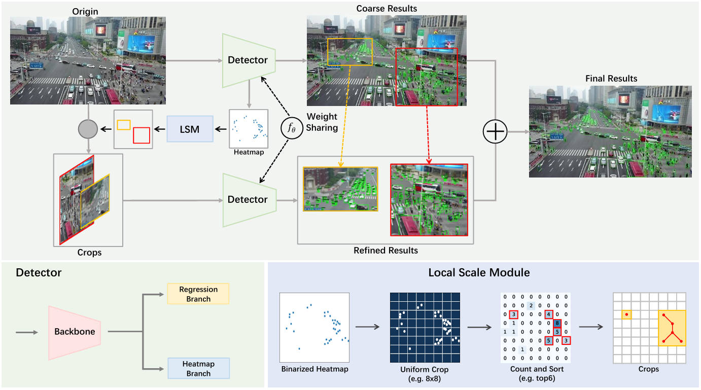

# You Only Look Clusters for Tiny Object Detection in Aerial Images

This is the implementation of "YOLC: You Only Look Clusters for Tiny Object Detection in Aerial Images".[[Paper](https://arxiv.org/abs/2404.06180)]

<p align="center">
    
</p>

## Requirement
This repo is implemented based on [mmdetection](https://github.com/open-mmlab/mmdetection). Please refer to [get_started.md](https://github.com/open-mmlab/mmdetection/blob/v2.26.0/docs/en/get_started.md)

	- Python >= 3.8
	- PyTorch >= 1.7.0
	- mmdetection == 2.26.0 (>=2.17.0, <3.0.0)
	- kornia == 0.6.9

## Checkpoint
We provide YOLC's checkpoint file. Please download model weights at the [Link](https://drive.google.com/file/d/1WDd77NYf8EXNaWKJuV9LfqCT9zdHajwG/view?usp=sharing).

##  Data preparation
Use gen_crop.py to generate VisDrone train dataset. You can directly use [annotations/VisDrone2019-DET_val_coco.json](annotations/VisDrone2019-DET_val_coco.json) for its val dataset.
```
python gen_crop.py
```

##  Train
#### Training on a single GPU
```
python train.py configs/yolc.py
```

#### Training on multiple GPUs
```
./dist_train.sh configs/yolc.py <your_gpu_num>
```

##  Eval
```
# set saved_crop to 0,1,2,3 corresponding to LSM (k=saved_crop)
python eval_yolc.py
```

## Citation
If you find our paper is helpful, please consider citing our paper:
```BibTeX
@article{liu2024yolc,
  title={YOLC: You Only Look Clusters for Tiny Object Detection in Aerial Images},
  author={Liu, Chenguang and Gao, Guangshuai and Huang, Ziyue and Hu, Zhenghui and Liu, Qingjie and Wang, Yunhong},
  journal={IEEE Transactions on Intelligent Transportation Systems},
  volume={25},
  number={10},
  pages={13863-13875},
  year={2024},
  publisher={IEEE}
}
```
